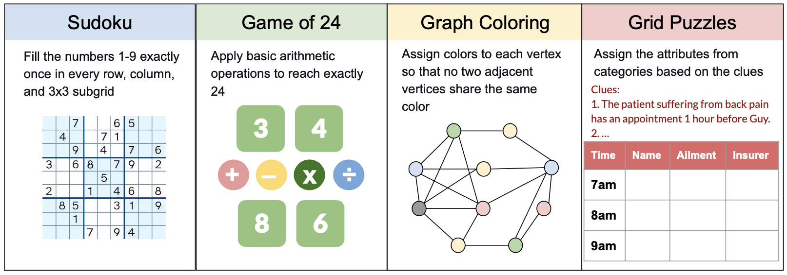

# FineReason: Evaluating and Improving LLMs’ Deliberate Reasoning through Reflective Puzzle Solving

This is the official repo for our paper ["FineReason: Evaluating and Improving LLMs’ Deliberate Reasoning through Reflective Puzzle Solving"](https://aclanthology.org/2025.acl-long.333/) in ACL 2025.

<p align="center">
    
</p>

## 📌 FineReason Overview

FINEREASON is a novel logic-puzzle benchmark designed to comprehensively evaluate the reasoning capabilities of LLMs. 

- Unlike existing benchmarks which focus on final-answer accuracy, FINEREASON delves into intermediate reasoning steps, specifically emphasizing state checking and transition actions, capturing key abilities such as reflection, lookahead, and backtracking—key aspects of human-like System 2 reasoning.

- Experiments reveal significant limitations in deep reasoning tasks, even for leading models like Gemini-2.0-Flash-Thinking, highlighting substantial room for improvement.

- Training on puzzle-based data enhances model performance in broader reasoning tasks, such as achieving a 5.1% accuracy improvement on GSM8K, demonstrating the potential of puzzle data to boost general reasoning capabilities.

## 💡 Tree-based Puzzle Decomposition
<p align="center">
    
</p>

- **Puzzle Solving as a Tree**: Intermediate states are nodes, state checking/transition are edges, allowing forward exploration and backtracking.
- **Comprehensive State Capture**: We use Depth-first search (DFS) to identify all valid states, validated by executable puzzle rules.
- **Evaluation Tasks**: State checking (solvability prediction) and state transition (next move determination) reveal reasoning processes in LLMs like reflection, correction, and path exploration.

## 🚀 Quick Start

### Environment Setup
```
conda create -n fine-reason python=3.10 -y
conda activate fine-reason
pip install -r requirements.txt
```

### API Setup
- Insert your OpenAI API key into the file `openai_key.json`.

- Insert your Gemini API key into the file `gemini_key.json`.

### Example Usage
To run Sudoku state checking using Gemini-2.0-Flash-Thinking:
```
python main.py evaluate \
--data_name sudoku_states \
--prompter_name sudoku_state_checking \
--scorer_name state_checking_accuracy \
--model_name gemini_flash_thinking
```
To run Sudoku state transition using Qwen-2.5-72B-Instruct with a max_output_length of 2048:
```
python main.py evaluate \
--data_name sudoku_states \
--prompter_name sudoku_state_checking \
--scorer_name state_checking_accuracy \
--model_name qwen \
--path_model Qwen/Qwen2.5-72B-Instruct \
--max_output_length 2048
```
To run end-to-end evaluation using OpenAI's  o1:
```
python main.py evaluate \
--data_name sudoku \
--prompter_name sudoku_e2e \
--model_name o1
```

## 📈 RL Training with Puzzle Data
Our training data is released at [HuggingFace](https://huggingface.co/datasets/Guizhen/Puzzles_10k).

## 🔗 Citation

If you find our work helpful, please consider starring this repo and citing our work.

```bibtex
@misc{chen2025finereasonevaluatingimprovingllms,
      title={FINEREASON: Evaluating and Improving LLMs' Deliberate Reasoning through Reflective Puzzle Solving}, 
      author={Guizhen Chen and Weiwen Xu and Hao Zhang and Hou Pong Chan and Chaoqun Liu and Lidong Bing and Deli Zhao and Anh Tuan Luu and Yu Rong},
      year={2025},
      eprint={2502.20238},
      archivePrefix={arXiv},
      primaryClass={cs.CL},
      url={https://arxiv.org/abs/2502.20238}, 
}
```